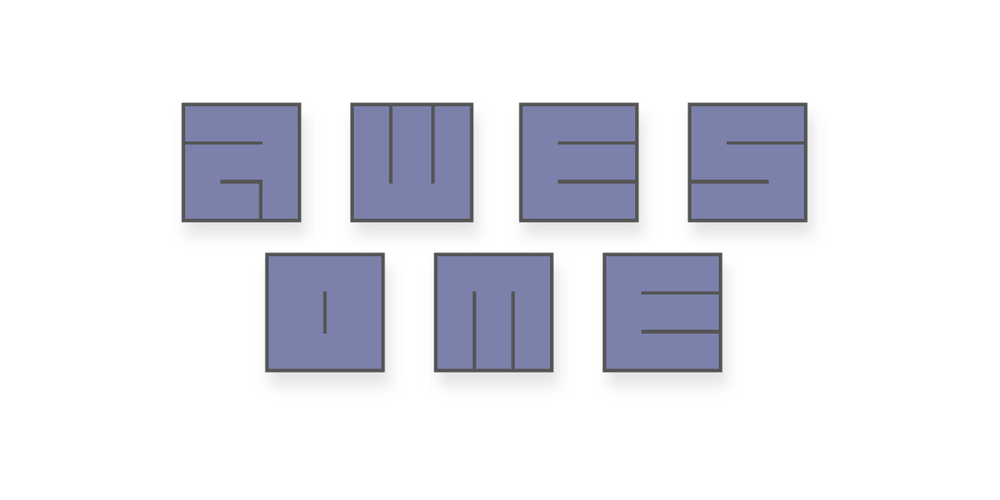
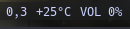

<p align="center">
  
</p>

# :sparkles: <samp>Awesome Widgets</samp>

<div align="center"> 

```css
I decided to do some widgets for AwesomeWM and so I thought in opening a
repository, and here we are.
```

</div>

---

### :bookmark_tabs: <samp>Table of Contents</samp>
- [:sparkles: Awesome Widgets](#sparkles-awesome-widgets)
    - [:bookmark_tabs: Table of Contents](#bookmark_tabs-table-of-contents)
    - [:bookmark_tabs: List](#bookmark_tabs-list)
    - [:camera: Gallery](#camera-gallery)
    - [:wrench: Dependencies](#wrench-dependencies)
    - [:bulb: Contributors](#bulb-contributors)
    - [:bust_in_silhouette: Credits](#bust_in_silhouette-credits)

---

### :bookmark_tabs: <samp>List</samp>

- [Weather](./widgets/weather/): A simple way to ~~display~~`curl` the weather of your current region in your bar using just [wttr.in](https://github.com/chubin/wttr.in).
- [Spotify Bar](./widgets/spotify_bar/): A widget to control the Spotify using only your wibar.
- [APT Updates](./widgets/apt_updates/): Widget to view updates count in your wibar.

---

### :camera: <samp>Gallery</samp>

| [Weather](./widgets/weather/) | 
| - |
|  |

| [Spotify Bar](./widgets/spotify_bar/) | 
| - |
|  |
|  |
|  |
|  |

| [APT Updates](./widgets/apt_updates/) | 
| - |
|  |

---

### :wrench: <samp>Dependencies</samp>

| Name | Description |
| - | - |
| [`curl`](https://github.com/curl/curl) | A command-line tool for transferring data specified with URL syntax. |
| [`awesome-git`](https://github.com/awesomewm/awesome) | Highly configurable framework window manager. |
| [`sp`](https://gist.github.com/fa6258f3ff7b17747ee3.git) | Spotify CLI controller |

---

### :rocket: <samp>Installation </samp>
The implementation of widgets is simple and fast, just follow a few steps

1. Clone this repository and copy the files to the Awesome WM configuration directory. eg:

```sh
git clone https://github.com/paodelonga/awesome-widgets.git
cp --recursive --parents awesome-widgets/widgets/ ~/.config/awesome/
```
 
2. And then go to the [init.lua](./widgets/init.lua) file and uncomment the line referring to the required widget

```diff
 -- To activate a Widget, move the line outside the comment block.
return {
	--[[
-   widget_name = require("widgets.widget_name")
	--]]
+   widget_name = require("widgets.widget_name")
}

 --[>D]
```

> The installation of some widgets may be different, so check the widget README for the correct installation method.

---

### :bulb: <samp>Contributors</samp>
<a href="https://github.com/paodelonga/awesome-widgets/graphs/contributors">
    
</a>

---

### :bust_in_silhouette: <samp>Credits</samp>
- [Paodelonga](https://github.com/paodelonga/)
- wttr.in [contributors](https://github.com/chubin/wttr.in/graphs/contributors)
- sp [contributors](https://gist.github.com/fa6258f3ff7b17747ee3.git)

[Back to top](#readme)

<!--
    --[>D]
-->
