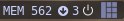

<p align="center">
  
</p>

# :rocket: <samp>APT Updates</samp>


Widget to view updates count in your wibar.

---

### :bookmark_tabs: <samp>Table of Contents</samp>
- [:rocket: APT Updates](#rocket-apt-updates)
    - [:bookmark_tabs: Table of Contents](#bookmark_tabs-table-of-contents)
    - [:wrench: Dependencies](#wrench-dependencies)
    - [:rocket: Installation](#rocket-installation)
    - [:gear: Configuration](#gear-configuration)
        - [:bookmark_tabs: Parameters](#bookmark_tabs-parameters)
    - [:bulb: Contributors](#bulb-contributors)
    - [:bust_in_silhouette: Credits](#bust_in_silhouette-credits)

---

### :wrench: <samp>Dependencies</samp>

| Name | Description |
| - | - |
| [`awesome-git`](https://github.com/awesomewm/awesome)  | Highly configurable framework window manager. |

---

### :rocket: <samp>Installation</samp>
Implementing this widget is as simple as peeling a banana :banana:.

1. Clone this repository and copy the files to the Awesome WM configuration directory. eg:

```sh
git clone https://github.com/paodelonga/awesome-widgets.git
cp --recursive --parents awesome-widgets/widgets/ ~/.config/awesome/
```

2. Then add the following lines to your [rc.lua](https://awesomewm.org/apidoc/documentation/07-my-first-awesome.md.html#Explore_Awesome)
 
```lua
-- Importing the widget
local widgets = require("widgets")

-- Configure the Widget
local apt_updates = widgets.apt_updates({
    timeout = 900,
    font = {
        name = "Font Name",
        color = "HEX Color Code"
    }
})
-- Add the Widget to your Wibar
s.wibar:setup({
    apt_updates
})

--[>D]
```

    
3. Then go to the [init.lua](./init.lua) file and uncomment the following line

	```diff
	 -- To activate a Widget move the line out of the comment block.
	return {
		--[[
	-   apt_updates = require("widgets.apt_updates")
		--]]
    +   apt_updates = require("widgets.apt_updates")
	}

	 --[>D]
	```

> Check the [configuration](#gear-configuration) category to learn more about the widgets parameters and settings.

Now the widget has been installed, to initialize just [restart your environment](https://awesomewm.org/apidoc/documentation/07-my-first-awesome.md.html#Wrapping_up).

---

### :gear: <samp>Configuration</samp>

#### :bookmark_tabs: <samp>Parameters</samp>

| Parameter | Description | Type | Value | Default |
| - | - | - | - | - |
| `timeout` |  Check execution interval | [`number`](https://www.lua.org/manual/5.3/manual.html#2.1) | `seconds` | `900` |
| `font` | Table containing information about the source | [`table`](https://www.lua.org/manual/5.3/manual.html#2.1) | `table` | |
| `font.name` | Name of the font to be used | [`string`](https://www.lua.org/manual/5.3/manual.html#2.1) | `font-family` | `Noto Mono 9` |
| `font.color` | Color of the font | [`string`](https://www.lua.org/manual/5.3/manual.html#2.1) | `hex color` | `#FAFAFA` |

---

### :bulb: <samp>Contributors</samp>
<a href="https://github.com/paodelonga/awesome-widgets/graphs/contributors">
    
</a>

---

### :bust_in_silhouette: <samp>Credits</samp>
- [Paodelonga](https://github.com/paodelonga/)

[Back to top](#readme)

<!--
    --[>D]
-->
