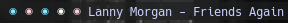
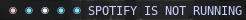
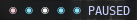
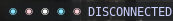

<p align="center">
    
</p>

# :sun_behind_large_cloud: Spotify Bar



A widget to control the Spotify using only your wibar.

---

### :bookmark_tabs: Table of Contents
- [:sun_behind_large_cloud: Spotify Bar](#sun_behind_large_cloud-spotify-bar)
    - [:bookmark_tabs: Table of Contents](#bookmark_tabs-table-of-contents)
    - [:wrench: Dependencies](#wrench-dependencies)
    - [:rocket: Installation](#rocket-installation)
    - [:gear: Configuration](#gear-configuration)
        - [:bookmark_tabs: Parameters](#bookmark_tabs-parameters)
    - [:rocket: Use](#rocket-use)
        - [:rocket: Actions](#rocket-actions)
        - [:rocket: Status](#rocket-status)
    - [:bulb: Contributors](#bulb-contributors)
    - [:bust_in_silhouette: Credits](#bust_in_silhouette-credits)

---

### :wrench: Dependencies

| Name | Description |
| - | - |
| [`awesome-git`](https://github.com/awesomewm/awesome)  | Highly configurable framework window manager. |
| [`sp`](https://gist.github.com/fa6258f3ff7b17747ee3.git) | Spotify CLI controller |

---

### :rocket: Installation
Implementing this widget is as simple as peeling a banana :banana:.

1. you need to have Spotify CLI installed, it uses dbus to communicate with spotify-client

```sh
git clone https://gist.github.com/fa6258f3ff7b17747ee3.git
cd ./fa6258f3ff7b17747ee3 
chmod +x sp
# This widget will work by default if the binary is in the system PATH
sudo cp ./sp /usr/local/bin/
# Alternatively, you may save the binary anywhere and supply the path via this widget's sp_bin argument:
# cp ./sp ~/.config/awesome/scripts/
```

2. Clone this repository and copy the files to the Awesome WM configuration directory. eg:

```sh
git clone https://github.com/paodelonga/awesome-widgets.git
cp --recursive --parents awesome-widgets/widgets/ ~/.config/awesome/
```

3. Then add the following lines to your [rc.lua](https://awesomewm.org/apidoc/documentation/07-my-first-awesome.md.html#Explore_Awesome)
 
```lua
-- Importing the widget
local widgets = require("widgets")

-- Configure the Widget
local spotify_bar = widgets.spotify_bar({
    timeout = 1,
    font = {
        name = "Font Name",
        color = "HEX Color Code"
    },
    separator = ' - ',
    sp_bin = 'sp_bin'
})
-- Add the Widget to your Wibar
s.wibar:setup({
    spotify_bar
})

--[>D]
```

    
4. Then go to the [init.lua](./init.lua) file and uncomment the following line

```diff
 -- To activate a Widget, move the line outside the comment block.
return {
	--[[
-   spotify_bar = require("widgets.spotify_bar")
	--]]
+   spotify_bar = require("widgets.spotify_bar")
}

 --[>D]
```

> Check the [configuration](#gear-configuration) category to learn more about the widgets parameters and settings.

Now the widget has been installed, to initialize just [restart your environment](https://awesomewm.org/apidoc/documentation/07-my-first-awesome.md.html#Wrapping_up).

---

### :gear: Configuration

#### :bookmark_tabs: Parameters

| Parameter | Description | Type | Default |
| - | - | - | - |
| `timeout` | Check execution interval | [`number`](https://www.lua.org/manual/5.3/manual.html#2.1) | `2` |
| `font` | Table containing information about the source | [`table`](https://www.lua.org/manual/5.3/manual.html#2.1)  |  |
| `font.name` | Name of the font to be used | [`string`](https://www.lua.org/manual/5.3/manual.html#2.1) | `Noto Mono 9` |
| `font.color` | Color of the font | [`string`](https://www.lua.org/manual/5.3/manual.html#2.1) | `#FAFAFA` |
| `separator` | Separator between song artist and title | [`string`](https://www.lua.org/manual/5.3/manual.html#2.1) | ` - ` | 
| `sp_bin` | path or name for the spotify dbus controller for linux | [`string`](https://www.lua.org/manual/5.3/manual.html#2.1) | `sp` |

---

### :rocket: Use

#### :rocket: Actions
Has some actions binded in this widget

| Button | Action |
| - | - |
| Mouse - Left Click | Play/Pause current song |
| Mouse - Right Click | Close/Open the Spotify |
| Mouse - Scroll Up | Previous song |
| Mouse - Scroll Down | Next song |

#### :rocket: Status

| Name | Preview |
| - | - |
| SPOTIFY IS NOT RUNNING | 
| PLAYING | 
| PAUSED | 
| DISCONNECTED | 

---

### :bulb: Contributors
<a href="https://github.com/paodelonga/awesome-widgets/graphs/contributors">
    
</a>

---

### :bust_in_silhouette: Credits
- [Paodelonga](https://github.com/paodelonga/)
- sp [contributors](https://gist.github.com/fa6258f3ff7b17747ee3.git)

[Back to top](#readme)

<!--
    --[>D]
-->
